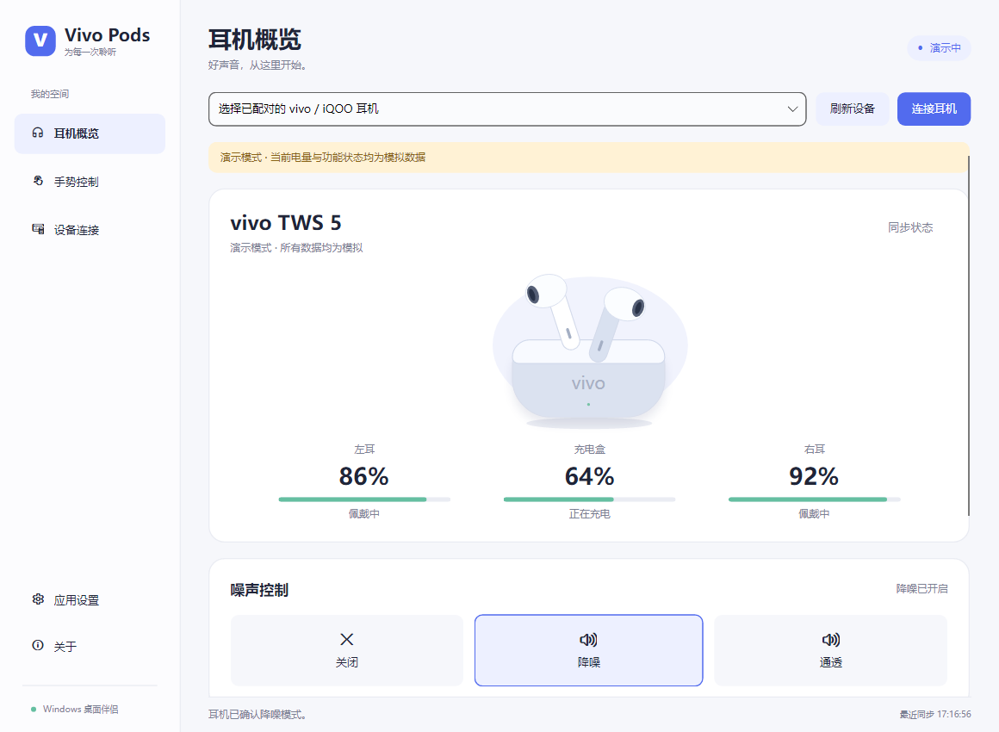

# Vivo Pods Manager

在 Windows 10 / 11 上管理 vivo / iQOO 蓝牙耳机。采用 C# / .NET 9 + Avalonia，应用效果和分层架构参考 [OppoPodsManager](https://github.com/Zhaoyi-ya/OppoPodsManager)，协议参考 [TWS-Pods-PC](https://github.com/Zhaoyi-ya/TWS-Pods-PC/tree/main/vivo)。



## 下载

从 [Releases](https://github.com/FLuoXue/VivoPodsManager/releases) 下载最新的 `VivoPodsManager-win-x64.zip`（ARM64 设备选 `win-arm64`），解压后运行 `VivoPodsManager.exe`。每次发布会同时附带 `SHA256SUMS.txt` 校验值。

## 使用

1. 解压便携包，先在 Windows「设置 → 蓝牙和设备」中配对、连接耳机。
2. 启动 `VivoPodsManager.exe`，选择设备并点击「连接耳机」。程序默认自动连接已经在线的已配对耳机。
3. 同名设备有经典蓝牙和 BLE 两个入口时，优先选择经典蓝牙。BLE 通道需要耳机支持对应私有 GATT 服务。
4. 关闭窗口默认留在托盘；右键托盘选择「退出」可完全退出。

自包含的 `win-x64` 便携包自带运行时，不需要另外安装 .NET。最低系统为 Windows 10 2004（19041），需要蓝牙适配器。

无耳机时可从首页或设置进入「演示设备」，也可用 `VivoPodsManager.exe --demo` 启动。演示会明确显示标识，不与真实蓝牙连接混用。

## 已实现

- 经典蓝牙和 BLE 已配对设备发现、指定设备连接、严格 GAIA 握手、断连检测与自动重连。
- 左右耳 / 充电盒电量、充电状态、实时佩戴状态；掉线和无效电量会置灰，避免将旧读数当实时数据。
- 关闭 / 降噪 / 通透；按型号编码降噪参数，设置后等待耳机确认。vivo TWS Air3 Pro 已通过官方 App HCI 捕获和 Windows 真机复测，支持均衡 / 轻度降噪子档位。
- 标准、清澈人声、超重低音、清亮高音、悠扬听书 EQ。
- 左右耳双击映射、长按噪声循环配置、佩戴检测开关、查找耳机及停止响铃。
- 固件信息、多设备列表、活动设备切换和双设备开关。TWS 3e 的双连显示为始终开启，不发送不支持的查询。
- 系统托盘、连接/低电量提示、关闭到托盘、单实例唤醒、Windows 登录启动、浅色/深色/跟随系统主题。
- 型号覆盖、本地偏好保存、按需导出诊断日志；无账户、无遥测、应用自身不联网。

型号能力声明覆盖上游表中的 41 个型号。能力声明不代表这些型号均经过本项目真机验证。Air3 Pro、TWS 3e、TWS 5 等按参考仓库的不同 wire profile 分开处理。未知名称不默认开放全部功能，可在设置中指定实际型号。

空间音效及低延迟游戏命令在协议来源中标注为推断，默认隐藏。可在设置开启「实验功能」并重新连接后尝试。未收到耳机确认时会显示失败，不提前改变状态。除已验证的 vivo TWS Air3 Pro 外，其他型号的降噪子档位和音频编解码器读取不作虚假展示。

## 编译与验证

安装 .NET 9 SDK 后，在仓库根目录运行：

```powershell
dotnet build VivoPodsManager.sln -c Release
dotnet run --project tests/VivoPods.Tests -c Release
dotnet run --project src/VivoPods.App -c Release
```

本地自动化验证覆盖抓包字节、拆包/粘包/校验、状态解析、型号能力、会话握手、命令回读、超时与断线。

```powershell
# 扫描真实 Windows 蓝牙；--connect 只向已连接的耳机发送初始化和只读查询
dotnet run --project tests/VivoPods.Tests -c Release -- --probe --connect

# 启动真实桌面程序，执行演示交互并导出页面截图，然后自动退出
dotnet run --project src/VivoPods.App -c Release -- --smoke --output artifacts/ui

# 创建自包含便携包
pwsh -File scripts/publish.ps1
```

测试入口为独立控制台校验器，使用 `dotnet run`，不是 `dotnet test`。

## 架构

```text
src/VivoPods.App          Avalonia UI、视图模型、托盘、设置
       ↓
src/VivoPods.Windows      Windows 设备发现、RFCOMM / GATT 传输
       ↓
src/VivoPods.Core         型号能力、GAIA 编解码、命令、状态、会话
tests/VivoPods.Tests      抓包回归、会话验证、可选真机探测
```

`PodManager` 管理单个选定设备的连接生命周期。传输只负责帧收发，`PodState` 按有效回包更新状态；界面通过主线程接收状态快照。所有设置操作串行发送并等待确认，旧会话回调不会污染新会话。协议关键依据与已知限制见 [协议说明](docs/PROTOCOL.md)，当前验证情况见 [验证记录](docs/VERIFICATION.md)。

设置保存至 `%LOCALAPPDATA%\VivoPodsManager\settings.json`。开机启动仅在用户开启设置后写入当前用户 Run 项。诊断日志保留最近 500 行于内存，只有点击导出才写入文件；日志可能含设备名称和地址，分享前请检查。

## 开源

GPL-3.0-only。协议移植与能力表来自 TWS-Pods-PC，应用架构参考 OppoPodsManager。完整来源与第三方声明见 [THIRD_PARTY_NOTICES.md](THIRD_PARTY_NOTICES.md)。本应用非 vivo 官方产品。
